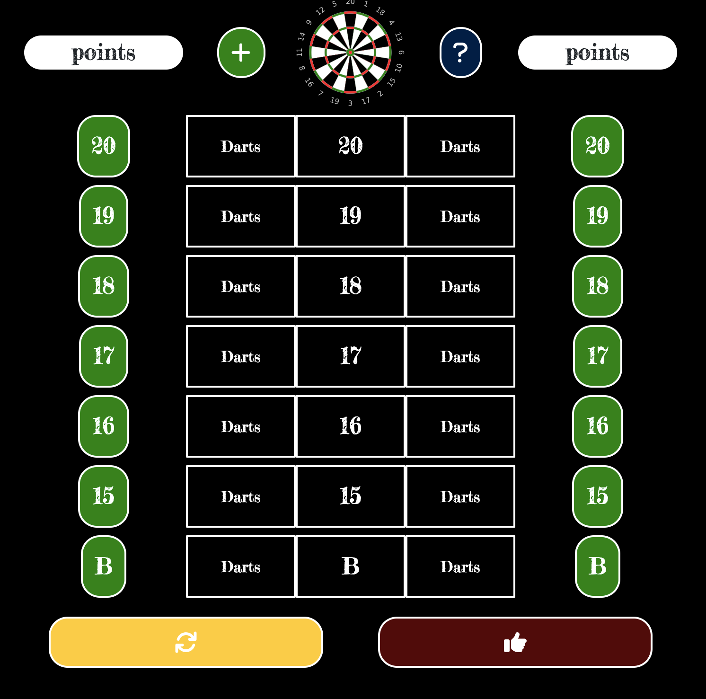

# Cricket Scorekeeper

# Table of Contents

- [Usage](#usage)
- [License](#license)
- [Contribute](#contribute)
- [Questions](#questions)
- [Github Profile](#github)
- [Get it on Google Play](#googleplay)
- [Deployed App](#deployedapp)

## Usage

This app scores darts for cricket according to the standard rules. Press the blue button with a question mark for help.

  
    
  ## License
  This software is under the [MIT](./LICENSE) license.
  
  ## Contribute
  Refer to [Contributor Covenant](https://www.contributor-covenant.org/) for contribution guidelines.

## Questions

Contact author at bagley@umn.edu for questions or to report issues.

## GitHub

https://github.com/bagl0025/cricket

## Google Play

## DeployedApp

https://bagl0025.github.io/cricket/
